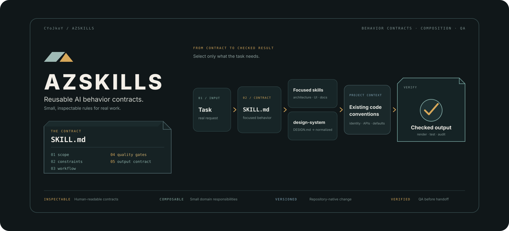

<div align="center">



### A focused collection of reusable AI skills for development, translation, localization, and documentation.

<p>
  <a href="#-overview">Overview</a> •
  <a href="#-skill-catalog">Skill Catalog</a> •
  <a href="#-installation--setup">Installation</a> •
  <a href="#-usage">Usage</a> •
  <a href="#-project-structure">Structure</a> •
  <a href="#-contributing--feedback">Contributing</a>
</p>

<p>
  
  
  
</p>

</div>

---

## 📖 Overview

**AzSkills** is a lightweight collection of reusable **AI agent skill definitions**. Each skill is isolated in its own directory and centered around a `SKILL.md` specification, making the repository easy to inspect, copy, version, and extend.

The collection currently covers five practical areas:

- **AHK v2 engineering** — optimization, standardization, performance, UI, memory, and testing guidance.
- **Multilingual translation** — language-aware translation into natural Chinese while preserving structure and formatting.
- **Game localization** — structured 13-language CSV localization with terminology consistency and BBCode preservation.
- **README engineering** — visual-first README generation, SVG assets, documentation structure, and GitHub-oriented presentation.
- **Chinese-to-English chat translation** — natural conversational English for casual, professional, gaming, and social contexts.

AzSkills is intentionally modular: use one skill independently, combine several skills in a workflow, or add your own skill without changing the existing definitions.

> **Design principle:** one directory, one purpose, one clearly defined behavior contract.

## ✨ Core Features

| Capability | What it provides |
| :--- | :--- |
| **Modular skill definitions** | Each capability lives in a self-contained `SKILL.md`. |
| **Explicit behavior contracts** | Trigger conditions, standards, workflows, and output rules are documented directly in the skill. |
| **Development standards** | AHK v2 guidance includes code size limits, control-flow rules, performance practices, UI optimization, and testing guidance. |
| **Localization workflows** | CSV-oriented localization rules cover 13 language columns, escaping, terminology, and BBCode integrity. |
| **Documentation tooling** | `readme-craft` defines README structure, visual direction, SVG requirements, and project-type adaptations. |
| **Language-aware translation** | Translation skills preserve intent, tone, formatting, and technical context instead of relying on literal conversion. |

---

## 🧩 Skill Catalog

### 🛠️ `ahkv2-opt`

**AHK v2 Code Optimization & Standardization**

A rule-driven engineering skill for refactoring and reviewing AutoHotkey v2 code. It covers file and function size limits, control-flow simplification, state management, hotkey design, timer behavior, data structures, DllCall usage, GUI performance, memory management, and testing.

[Open `ahkv2-opt`](ahkv2-opt/SKILL.md)

### 🌐 `any2zh`

**Multilingual Translation to Chinese**

A general-purpose translation skill for converting content from major world languages into natural Chinese while preserving meaning, tone, terminology, formatting, and culturally specific expressions.

[Open `any2zh`](any2zh/SKILL.md)

### 🎮 `l13n`

**13-Language Game Localization**

A structured localization workflow for game CSV data. It enforces the fixed language schema, translation consistency, BBCode preservation, CSV escaping, and complete coverage across all supported locales.

[Open `l13n`](l13n/SKILL.md)

### 📝 `readme-craft`

**Professional README Generation**

A visual-first documentation skill for creating structured, polished README files. It defines Hero composition, dark-theme styling, SVG asset generation, feature presentation, project-structure formatting, project-type adaptation, and GitHub-friendly documentation patterns.

[Open `readme-craft`](readme-craft/SKILL.md)

### 💬 `zh2en`

**Chinese-to-English Conversational Translation**

A chat-focused translation skill for turning informal, slang-heavy, or context-dependent Chinese messages into natural English suitable for everyday conversation, work, gaming, and social communication.

[Open `zh2en`](zh2en/SKILL.md)

---

## 🚀 Installation & Setup

AzSkills is a collection of skill definitions rather than a standalone executable application. There is no build step or package installation required by the repository itself.

### Clone the repository

```bash
git clone https://github.com/CYoJkoY/AzSkills.git
cd AzSkills
```

### Select a skill

Choose the directory that matches the task you want to support:

```text
ahkv2-opt/
any2zh/
l13n/
readme-craft/
zh2en/
```

### Register the skill with your agent

Copy or link the selected skill directory into the skill-discovery location used by your AI agent or development environment. The skill is defined by its `SKILL.md` file and does not require compilation.

> **Note:** Skill discovery paths vary between agent frameworks. Keep the directory name and `SKILL.md` together when integrating a skill.

---

## 📚 Usage

Each skill is designed to be invoked by matching its purpose, trigger conditions, and documented workflow.

For example, an agent working on an AutoHotkey v2 module can load `ahkv2-opt` when asked to refactor or optimize code. A documentation workflow can use `readme-craft` to generate a visual README and its SVG assets. A localization workflow can apply `l13n` to a structured CSV without changing its schema.

A typical workflow is:

```text
User task
   │
   ▼
Select relevant skill
   │
   ▼
Read SKILL.md
   │
   ▼
Apply its workflow and constraints
   │
   ▼
Produce task-specific output
```

The skills are deliberately explicit so an agent can inspect the rules before acting instead of depending on undocumented conventions.

---

## 🧠 Implementation Highlights

### Self-contained specifications

Every skill is packaged as a small, readable Markdown specification with frontmatter, purpose, workflows, and enforcement rules. This keeps the skill portable and easy to review.

### Constraint-driven workflows

The skills do more than describe goals. They define concrete constraints such as line-count limits, output schemas, formatting preservation, terminology requirements, or README section standards.

### Specialized rather than monolithic

AzSkills does not try to create one universal prompt. Specialized skills can be selected independently and combined only when their responsibilities overlap in a useful way.

### Human-readable by design

Because the core artifact is Markdown, developers can audit, edit, review, and version-control the rules without a separate authoring toolchain.

---

## 📁 Project Structure

```tree
AzSkills/
├── 📁 ahkv2-opt/
│   └── 📄 SKILL.md
├── 📁 any2zh/
│   └── 📄 SKILL.md
├── 📁 l13n/
│   └── 📄 SKILL.md
├── 📁 readme-craft/
│   ├── ⚖️ LICENSE
│   └── 📄 SKILL.md
├── 📁 zh2en/
│   └── 📄 SKILL.md
├── 📁 assets/
│   └── 🖼️ azskills-hero.svg
├── ⚖️ LICENSE
└── 📖 README.md
```

---

## 🛡️ Design & Maintenance Principles

AzSkills follows a few simple maintenance rules:

1. Keep each skill focused on a clearly bounded responsibility.
2. Keep operational rules inside the corresponding `SKILL.md` rather than scattering them across the repository.
3. Prefer explicit workflows and output contracts over vague behavioral descriptions.
4. Keep documentation and examples aligned with the actual skill definition.
5. Preserve the existing directory-level naming convention when adding new skills.

---

## 🤝 Contributing & Feedback

Contributions are welcome, especially improvements that make a skill more precise, reusable, or easier for agents to follow.

When adding a skill, include a concise frontmatter definition, clear trigger conditions, explicit workflow rules, practical examples where useful, and a scope that does not overlap unnecessarily with existing skills.

For bug reports, describe the affected skill, the input that triggered the problem, the expected behavior, and the observed behavior.

---

## 📄 License

AzSkills is released under the **MIT License**.

See [`LICENSE`](LICENSE) for the complete license text.

---

## 💰 Support the Author

If AzSkills improves your development or documentation workflow, consider supporting the project.

<div align="center">
  <a href="https://cyojkoy.github.io/Payment/">
    
  </a>
</div>

<div align="center">
  <br>
  <i>Built as a modular toolkit for AI-assisted work.</i>
</div>

---

<div align="center">

**AzSkills** · Modular AI Skills for Real Work

</div>
