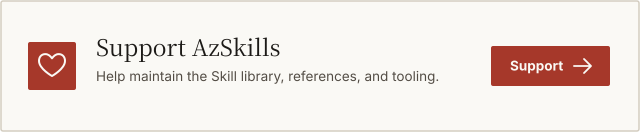

# AzSkills

<picture>
  <source media="(prefers-color-scheme: dark)" srcset="assets/azskills-hero-dark.svg">
  <source media="(prefers-color-scheme: light)" srcset="assets/azskills-hero.svg">
  
</picture>

Version **7.7.0**. A catalog of independent Codex plugins, not one plugin with hidden modules.

Every plugin ships with its own manifest, skill entry, trigger description, reference closure, and icon. A single dispatcher entry only fires when a prompt names it or matches one broad description; independent plugins are matched directly, so capabilities stop being invisible to automatic routing. Plugins are grouped by the job a request asks for, and each group stays small enough to answer one kind of request, so grouping never hides a capability behind an unrelated name. `catalog/plugins.json` is the distribution registry and `skills.json` stays the canonical module and alias source.

| Kind | Plugins | Count |
| :--- | :--- | :--- |
| Workflow | engineering, design, visual-assets, visual-production, writing, delivery-loop | 6 |
| Standalone | serena, rea | 2 |

Each workflow plugin bundles the related contracts that a single job needs, and ships one router skill so selecting the plugin exposes every member contract:

| Plugin | Workflows | Focus |
| :--- | :--- | :--- |
| `engineering` | architecture, az-clean-code, godot-3-dev, tool-integration, taste | Runtime, frontend stack, persistence, process boundaries, explicit code, code style consistency, Godot 3.x GDScript, AI client setup, and judgment and collaboration behavior. |
| `design` | design-system, ui-design, style-presets | Design systems, interface hierarchy, states, responsive behavior, motion, visual QA, and named presets. |
| `visual-assets` | logo-generator, photo-abstract-editorial, scientific-figures | Logos, editorial image treatments, and verified scientific or medical figures. |
| `visual-production` | frontend-slides, remotion-production | Responsive HTML reports, fixed-stage presentations, and deterministic video. |
| `writing` | document-writing, localization, resume-evidence-workflow | GitHub READMEs, Steam Workshop pages, game CSV localization, and evidence-backed resumes. |
| `delivery-loop` | delivery-loop | Unattended issue-to-merge delivery with touch-scope leases, worktree isolation, enforced commit and PR standards, independent Elephant-Goldfish review, gated auto-merge, and a plugin-native long-horizon goal run that works without Goal mode. |

The standalone plugins wrap an upstream MCP server and its own repository icon: `serena` adds Serena's semantic code intelligence, and `rea` adds REA's reverse-engineering tools. They ship no skill-folder view, so install them from the marketplace.

## Install

Requires Node.js 22.18 or later (23.6+ on Node 23, which enabled type stripping mid-release), because the scripts run as native TypeScript.

Install selected workflow plugins as skill folders:

```sh
node scripts/install-skills.ts --tool codex --mode project --project /path/to/project --plugin engineering,design --dry-run
node scripts/install-skills.ts --tool codex --mode project --project /path/to/project --plugin engineering,design --yes
```

Each selected plugin becomes `/path/to/project/.agents/skills/<id>/SKILL.md` with its own reference closure. A module id such as `ui-design` installs the workflow plugin that owns it, so old names keep working. Use `--all-plugins` for every workflow plugin, `--mode user` for the client user directory, `--target <skills-root>` to override the destination, or `--list` to see supported clients. Running without arguments opens a client-selection prompt. Bare installs select all workflow plugins.

For the full catalog including hooks, use the Codex plugin marketplace:

```sh
node scripts/package-plugin.ts --output /path/to/fresh/exports
codex plugin marketplace add /path/to/fresh/exports/azskills-marketplace
```

```sh
codex plugin marketplace add https://github.com/CYoJkoY/AzSkills.git
```

The Git repository is a ready-to-use marketplace: it publishes the built catalog at `dist/azskills-marketplace/`, with a root manifest that points to it. The build writes `azskills-marketplace/.agents/plugins/marketplace.json` plus one self-contained directory per plugin under `plugins/<id>/`, and deterministic archives under `zips/<id>.zip`. Install the plugins you need from the marketplace; each plugin carries a narrow description and is matched on its own. These plugins ship hooks: `engineering` (GPT with Taste steering on session start, request, and subagents, plus the Godot 3.x write guard), `delivery-loop` (delivery-state guard that permits reviewer sub-agents only inside a review window, auto-approves repeated reads, tests, and a goal's own `--allow` patterns, restarts a dead loop, and continues an active goal), `serena` and `rea` (a `UserPromptSubmit` pointer to their own skill when a code-intelligence or reverse-engineering prompt matches), and `design`, `visual-assets`, and `visual-production` (a `UserPromptSubmit` pointer to their router skill when an English or Chinese prompt looks visual). Review and trust the hooks when prompted. Hooks require Node.js 22.18 or newer on PATH (23.6+ on Node 23) and support installation paths containing spaces. The `delivery-loop` hooks replay the original prompt when a tool call or final reply repeats, and keep an active goal in `.azflow/goal.json` running through transient retries, budget extensions, and bounded review repairs until it finishes or stalls. See the [Codex upgrade and verification guide](integrations/guides/codex.md).

See [client integration guides](integrations/README.md) for Codex plugin setup, skill folders, manual import, and MCP configuration. Client discovery depends on the client scan scope and may require a restart. The installer verifies local contents separately from actual client discovery and invocation.

## Use

Ask naturally, for example:

- "Review the architecture of this application." matches the `engineering` plugin.
- "Refine the interface and add its motion." matches the `design` plugin.
- "Turn these findings into an HTML report." matches the `visual-production` plugin.
- "Write the README for this repository." matches the `writing` plugin.

You may name a workflow such as `architecture/frontend` or a legacy name such as `frontend-architecture`; both resolve to the workflow plugin that owns the contract. Read [routing](references/routing.md) for outcomes and modes; the [catalog index](SKILL.md) lists every plugin.

## Upgrade and rollback

The installer records installed plugin ids in a schema 4 `.azskills-manifest.json` and migrates older manifests (schemas 1 to 3, including the former single `azskills` directory). It preserves unrelated paths and refuses an unmanaged conflicting plugin directory. An old manual installation without a manifest needs manual reconciliation after reviewing its files. `--skills` remains a legacy alias for `--plugin`.

Backups live outside the scan root, in a sibling `.<skills-root-name>-azskills-backups` directory. Existing in-root AzSkills backups move there during migration so their old manifests cannot be rediscovered. Rollback restores the previous entries, previous manifest bytes, and previous in-root backup location, so it intentionally restores the previous discovery behavior too.

```sh
node scripts/install-skills.ts --verify --target /path/to/skills
node scripts/install-skills.ts --rollback --target /path/to/skills --yes
node scripts/install-skills.ts --uninstall --target /path/to/skills --yes
```

Uninstall backs up and removes managed plugin directories. Rollback restores the immediately preceding operation; an unchanged install preserves the existing rollback point. Backups are retained for recovery and are not automatically purged. A missing or modified rollback snapshot requires manual recovery.

## Workflow contracts

These contracts are ordinary Markdown files. Each one is the workflow that its plugin ships, and it retains the domain workflow and output gates.

For a visual starting point, open the [preset catalog](style-presets/references/catalog.md)
or the [interactive style and loader gallery](style-presets/assets/gallery.html).
Say "show the style catalog", "use BioRender style", or "add a CSS loader";
the request resolves to the owning workflow. Medical or research drawing
requests select [Scientific Figures](references/modules/scientific-figures.md),
also available as `sciprism-svg`. Its [runnable pipeline](scientific-figures/references/pipeline.md)
turns scene JSON into editable SVG and checks the result.

<!-- SKILL-CATALOG:START -->
| Family | Module | Modes | Focus |
| :--- | :--- | :--- | :--- |
| Architecture | [`architecture`](references/modules/architecture.md) | runtime, frontend, migration, review | Runtime, frontend stack, persistence, and process boundaries. |
| Interface | [`design-system`](references/modules/design-system.md) | ingest, author, migrate, audit | DESIGN.md ingestion, normalization, provenance, and verification. |
| Interface | [`ui-design`](references/modules/ui-design.md) | build, refine, review, system, motion, motion-review, motion-audit, motion-pattern, svg | Interface hierarchy, components, states, responsive behavior, visual QA, motion construction, review, audit, patterns, and SVG animation. |
| Visual | [`logo-generator`](references/modules/logo-generator.md) | mark, character, system | Logos, product marks, character marks, and identity systems. |
| Visual | [`photo-abstract-editorial`](references/modules/photo-abstract-editorial.md) | treatment, audit | Photograph-preserving abstract editorial diptychs. |
| Production | [`frontend-slides`](references/modules/frontend-slides.md) | new, convert, enhance, report | Responsive HTML reports, fixed-stage presentations, and rendered QA. |
| Production | [`remotion-production`](references/modules/remotion-production.md) | video, data, 3d, ui-showcase, motion, av | Deterministic programmatic video and render delivery. |
| Publishing | [`document-writing`](references/modules/document-writing.md) | readme, readme-rewrite, readme-audit, steam-player, steam-developer, steam-audit | GitHub README architecture, visuals, links, QA, Steam Workshop BBCode pages, and bilingual delivery. |
| Publishing | [`localization`](references/modules/localization.md) | translate, audit | Game CSV localization with locale completeness and markup safety. |
| Career | [`resume-evidence-workflow`](references/modules/resume-evidence-workflow.md) | evidence, tailor, review | Career evidence, requirement alignment, and editable resume delivery. |
| Operations | [`tool-integration`](references/modules/tool-integration.md) | install, configure, troubleshoot, remove | Connect AzSkills to AI clients with verified installation and setup workflows. |
| Operations | [`delivery-loop`](references/modules/delivery-loop.md) | init, plan, work, review, ship, recover, goal | Unattended issue-to-merge delivery with touch-scope leases, worktree isolation, enforced commit and PR standards, independent Elephant-Goldfish review, gated auto-merge, and a long-horizon goal run. |
| Operations | [`taste`](references/modules/taste.md) | main, subagent, independent | Judgment, collaboration, and execution behavior automatically supplied by Codex hooks. |
| Architecture | [`az-clean-code`](references/modules/az-clean-code.md) | write, review, refactor, style | Explicit code, flat control flow, reuse, code style consistency, and business data externalized before coding. |
| Architecture | [`godot-3-dev`](references/modules/godot-3-dev.md) | script, review, port | Godot 3.x GDScript, virtual-call safety, the 3.6 API surface, and down-porting. |
| Interface | [`style-presets`](references/modules/style-presets.md) | catalog, apply, loaders, audit | Named visual presets, keyword triggers, preset token packs, and loading indicators. |
| Visual | [`scientific-figures`](references/modules/scientific-figures.md) | redraw, author, verify | Medical and scientific schematics, faithful redraws, editable SVG, and deterministic figure verification. |
<!-- SKILL-CATALOG:END -->

## Legacy names

<!-- SKILL-ALIASES:START -->
| Alias | Module | Mode |
| :--- | :--- | :--- |
| `application-architecture` | [`architecture`](references/modules/architecture.md) | runtime |
| `frontend-architecture` | [`architecture`](references/modules/architecture.md) | frontend |
| `ui-aesthetics` | [`ui-design`](references/modules/ui-design.md) | refine |
| `ui-ux-design-intelligence` | [`ui-design`](references/modules/ui-design.md) | review |
| `ui-motion-review` | [`ui-design`](references/modules/ui-design.md) | motion-review |
| `ui-motion-audit` | [`ui-design`](references/modules/ui-design.md) | motion-audit |
| `rare-ui-motion` | [`ui-design`](references/modules/ui-design.md) | motion-pattern |
| `svg-animation` | [`ui-design`](references/modules/ui-design.md) | svg |
| `ip-as-logo` | [`logo-generator`](references/modules/logo-generator.md) | character |
| `l13n` | [`localization`](references/modules/localization.md) | translate |
| `biorender` | [`style-presets`](references/modules/style-presets.md) | apply |
| `biorender-style` | [`style-presets`](references/modules/style-presets.md) | apply |
| `cobalt-kit` | [`style-presets`](references/modules/style-presets.md) | apply |
| `css-loaders` | [`style-presets`](references/modules/style-presets.md) | loaders |
| `style-catalog` | [`style-presets`](references/modules/style-presets.md) | catalog |
| `sciprism-svg` | [`scientific-figures`](references/modules/scientific-figures.md) | redraw |
| `readme-craft` | [`document-writing`](references/modules/document-writing.md) | readme |
| `readme-rewrite` | [`document-writing`](references/modules/document-writing.md) | readme-rewrite |
| `steam-mod-page` | [`document-writing`](references/modules/document-writing.md) | steam-player |
| `ui-motion` | [`ui-design`](references/modules/ui-design.md) | motion |
| `ui-motion-build` | [`ui-design`](references/modules/ui-design.md) | motion |
| `sci-figure` | [`scientific-figures`](references/modules/scientific-figures.md) | author |
<!-- SKILL-ALIASES:END -->

## MCP

Register `node scripts/azskills-mcp.ts` as a stdio server named `azskills`. Call `azskills` with `action: catalog` to list plugins, `entry` for this catalog index, `plugin` plus `id` for one plugin contract, `route` for the routing table, `module` plus `id` (optionally `mode`) for one contract, or `file` plus a path for supporting content. Paths are matched against packaged files; arbitrary filesystem access is unavailable. Resources are `azskills://catalog` and `azskills://plugins/<id>[/<path>]`.

## Contributing and verification

See [module system](SKILL-SYSTEM.md), [design contract](DESIGN.md), [design intelligence](design-intelligence.md), [catalog migration](docs/plugin-catalog-migration.md), and [third-party notices](THIRD_PARTY_NOTICES.md). License: [MIT](LICENSE).

After `npm ci`, `npm run check` runs the type check, validators, and tests. The individual commands are:

```sh
node scripts/generate-routing.ts --check
node scripts/validate-skills.ts
node scripts/validate-catalog.ts
node scripts/validate-integrations.ts
node scripts/check-marketplace.ts
node scripts/test-link-bundle.ts
node scripts/test-package-plugin.ts
node scripts/test-think-tags-hook.ts
node scripts/test-install-skills.ts
node scripts/test-azskills-mcp.ts
node design-system/tui/preview.ts --check
```

The terminal preview is a contributor view of the contract catalog; it is not the client plugin panel.

Report bugs or propose plugin improvements through the repository issue templates. Keep each plugin self-contained, version changed contracts, and verify portable links and migration behavior before submitting changes.

## Support

Support maintenance of the plugins, references, and tooling.

[Support AzSkills](https://cyojkoy.github.io/Payment/)

<a href="https://cyojkoy.github.io/Payment/">
  <picture>
    <source media="(prefers-color-scheme: dark)" srcset="assets/readme/support-cta-dark.svg">
    <source media="(prefers-color-scheme: light)" srcset="assets/readme/support-cta.svg">
    
  </picture>
</a>
